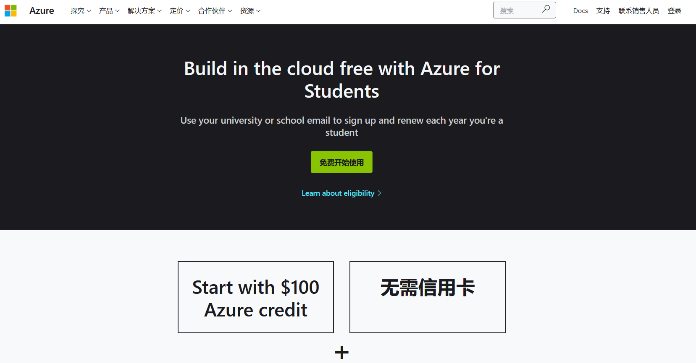
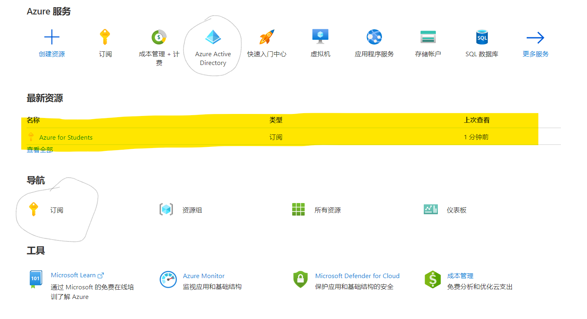
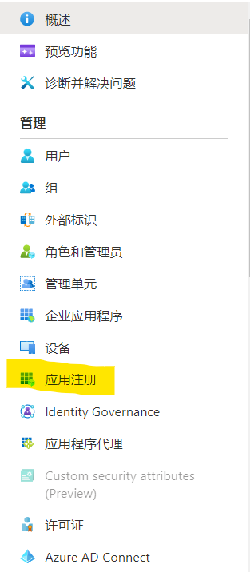
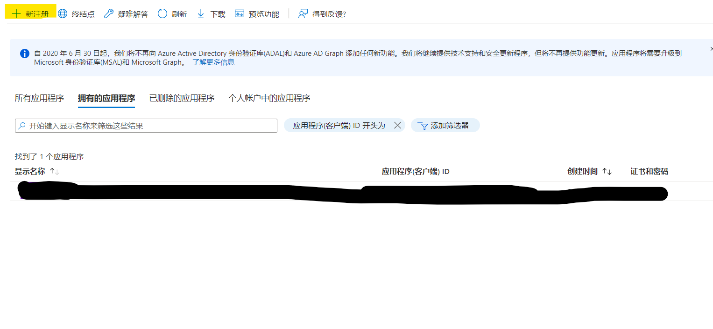
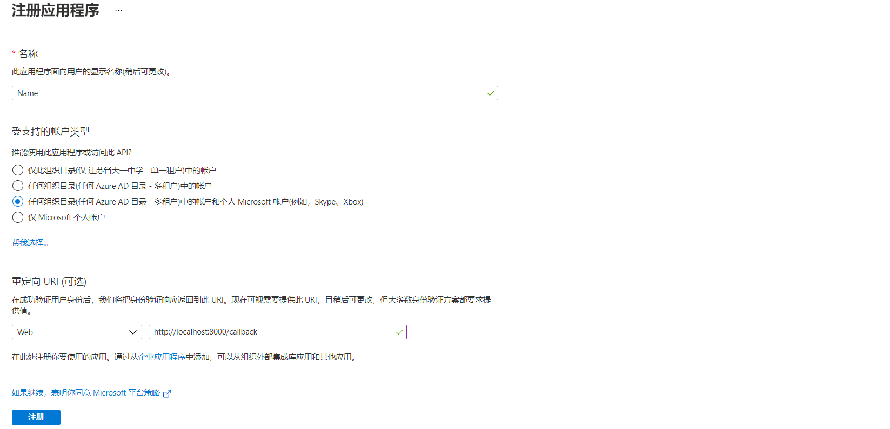
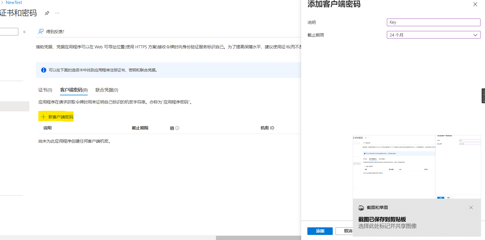
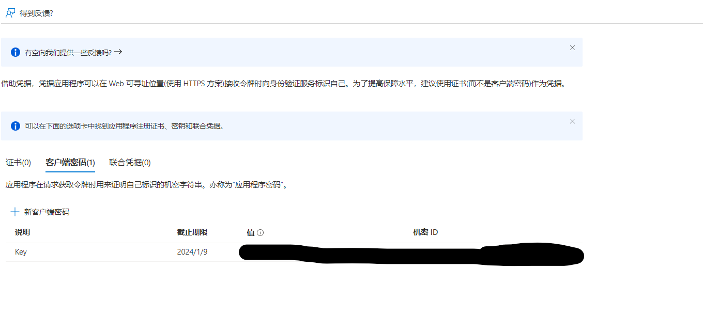

[TOC]

# 配置你的Outlook账户以同步日程

---

## 引言

Magirror v2.0最大的更新就在于可以同步日程。该功能需要你配置自己的Outlook信息，让Magirror能够调用接口读取到你的Outlook日历并显示。

---

##  :hammer:让我们开始吧

### 1. 注册Azure账户

因为Outlook接口API是office365的服务，因此需要开通一个Azure账户得到访问权限。不用担心，这项服务是免费的，只要你注册了Azure账户即可免费使用。

注册流程：

* 登录[Azure官网(学生版)](https://azure.microsoft.com/zh-cn/free/students/)。

  普通用户注册Azure账户是需要添加一张visa信用卡进行验证的，但是在中国visa卡难以获取，且卡费较为昂贵。所以推荐使用学生身份注册，无需绑定信用卡。

  

点击`开始免费使用`，接下来你会被引导填入一些身份认证信息，包括Microsoft账户、学生身份等。填写完毕后就完成了Azure账号注册。

注册成功后，在Azure门户(Azure Portal)界面可以看到有一个"Azure for Students"的订阅。(没有在门户找到的话，可以在`订阅`选项中查看)

* 创建APP

  点击Azure Active Directory(上图圈出来的蓝色金字塔图标)，在左侧菜单栏选择`应用注册`,然后选择`新注册`

  

      
      
  

​	

​	在注册页面填写信息，包括应用名、应用类型、重定向URI等。

​	应用名随便取，(不推荐带有中文)；应用类型选择第三个；

​	重定向URI类型为Web, 地址建议为`http://localhost:8000/callback`，**这就是yml文件中的`redirect`。**

注册完毕后会看到以下界面：

**此处`应用程序（客户端）ID`即为`OutlookConfig.yml`文件中的`client_id`。**

点击`添加证书和机密`，输入`说明`(随便填，建议不要有中文)，选择有效期，选择`添加`

这时会显示app的秘钥，**此时一定要先把`值`的内容复制下来，之后再打开这个页面，秘钥是不会显示的！所以一定要此时立刻复制！**

`值`的内容就是yml文件中的`client_secret`。

