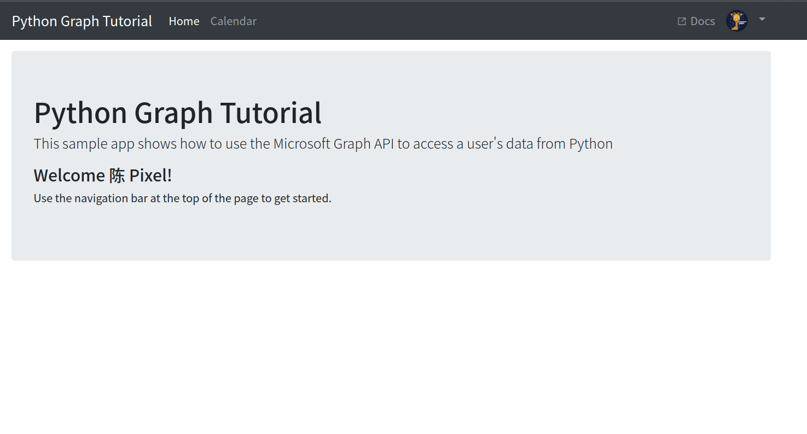

[TOC]

# 配置你的Outlook账户以同步日程

---

## 引言

Magirror v2.0最大的更新就在于可以同步日程。该功能需要你配置自己的Outlook信息，让Magirror能够调用接口读取到你的Outlook日历并显示。

---

##  :hammer:让我们开始吧

### 1. 注册Azure账户

因为Outlook接口API是office365的服务，隶属于`Microsoft Graph API`,因此需要开通一个Microsoft Azure账户得到访问权限。不用担心，这项服务是免费的，只要你注册了Azure账户即可免费使用。

注册流程：

* 登录[Azure官网(学生版)](https://azure.microsoft.com/zh-cn/free/students/)。

  普通用户注册Azure账户是需要添加一张visa信用卡进行验证的，但是在中国visa卡难以获取，且卡费较为昂贵。所以推荐使用学生身份注册，无需绑定信用卡。(当然如果你自己就有办法弄到一张visa卡，当我没说，也可以注册普通个人版的)

  

点击`开始免费使用`，接下来你会被引导填入一些身份认证信息，包括Microsoft账户、学生身份等。填写完毕后就完成了Azure账号注册。

注册成功后，在Azure门户(Azure Portal)界面可以看到有一个"Azure for Students"的订阅。(没有在门户找到的话，可以在`订阅`选项中查看)

* 创建APP

  点击Azure Active Directory(上图圈出来的蓝色金字塔图标)，在左侧菜单栏选择`应用注册`,然后选择`新注册`

  

      
      
  

​	

​	在注册页面填写信息，包括应用名、应用类型、重定向URI等。

​	应用名随便取，(不推荐带有中文)；应用类型选择第三个；

​	重定向URI类型为Web, 地址建议为`http://localhost:8000/callback`，**这就是yml文件中的`redirect`，将之填入。**

注册完毕后会看到以下界面：

**此处`应用程序（客户端）ID`即为`OutlookConfig.yml`文件中的`client_id`，将之填入**

点击`添加证书和机密`，输入`说明`(随便填，建议不要有中文)，选择有效期，选择`添加`

这时会显示app的秘钥，**此时一定要先把`值`的内容复制下来，之后再打开这个页面，秘钥是不会显示的！所以一定要此时立刻复制！**

**`值`的内容就是yml文件中的`client_secret`,将之填入。**

---

### 2.获取Token

Token是用户访问`Microsoft Graph API`的唯一途径，在Web网页应用中，用户通过手动键入账户密码，授权许可，即可访问`Microsofr Graph API`，但是这个过程必须要有用户手动的操作确认授权，(类比微信windows版，每次登录都要手动确认)，对于魔镜这样的应用非常不方便，因此可以考虑使用官方提供的`refresh token`机制。

所谓`refresh token`，顾名思义，根据之前成功访问使用的token，产生之后访问用的token。具体可以理解为，用户在浏览器第一次授权登录Microsoft账户时，手动授权，这时会产生token信息，包含`access_token`和`refresh_token`。`access_token`用于本次授权，生命周期一般为一小时；而`refresh_token`则相当于是留下了一份DNA信息，生命周期**理论上**(注：在官方文档并没有查询到相关信息，不过根据亲身实践，两个礼拜过去了，最开始的`refresh_token`仍然有效)是永久的，以后授权登录的时候，可以根据这份"DNA信息"，调用函数`acquire_token_by_refresh_token()`生成一个新的`token`进行访问。

所以现在的任务就是获取到你的`refresh_token`! 

2.1. 打开项目根目录`Utils/graph_tutorial`文件夹，先使用`pip install -r requirements.txt`安装依赖

2.2. 配置`auth_settings.yml`文件，内容几乎同`Function/OutlookConfig.yml`。

2.3. 在此处打开终端/cmd，运行`python manage.py runserver`，如果没有报错，说明配置正确。

2.4. 打开浏览器，访问`http://localhost:8000/callback`(就是你配置的Redirect URI地址)，按照提示登录授权。

以下是登录授权成功后的界面:

此时点击顶部的`Calendar`,如果跳转的界面能够正常显示你的日历日程，说明配置正确。

2.5. 成功完成以上的操作后，在当前目录会生成一个`refresh_token.txt`的文件,里面即保存着你的`refresh_token`，将他复制，填入`Function/OutlookConfig.yml`文件的对应位置。

---

## :gift:Congratulations!:gift:

大功告成！现在Outlook已经全部配置完毕！

---

## :star:使用技巧

#### 1. 同步日历

Outlook本身就已经是一个非常好用的日程规划软件了！最棒的是Outlook支持自己导入日历，导入的日历包括但不限于iCloud日历，google日历等，同理也可以在iCloud日历、google日历、华为日历等各种日历应用中添加Outlook日历，这样的话你所有的日历都可以导入同步到Outlook中，被魔镜统一调用，是不是很方便呢！

#### 2.查看课表(学生党强推！)

对于学生党来说，最最最重要的一个功能是看课表！下面介绍如何使用魔镜看你的课表

其实原理还是不变的，通过魔镜读取Outlook的日历，然后显示，那么现在就是要解决如何把课程表导入到Outlook中。前面提到，Outlook可以导入各式各样的日历，这些日历不仅包含iCloud日历这种在线日历，还包含.ics文件，你可以把ics文件理解成存储日历的一种格式化文件。

为了得到课表的ics文件，这里向大家推荐个手机APP，`WakeUp课程表`，支持全国绝大部分高校的教务系统。在软件中登入你所在学校的教务系统导入课表之后，点击主页面上的分享按钮，选择`导出为ICS(日历用)格式`, 课表就保存到本地文件啦！然后再打开你的Outlook应用，选择`添加日历`,选择本地ics文件导入，OK了！现在康康你的Outlook日历是不是能够显示你的课表了呢！很方便吧
